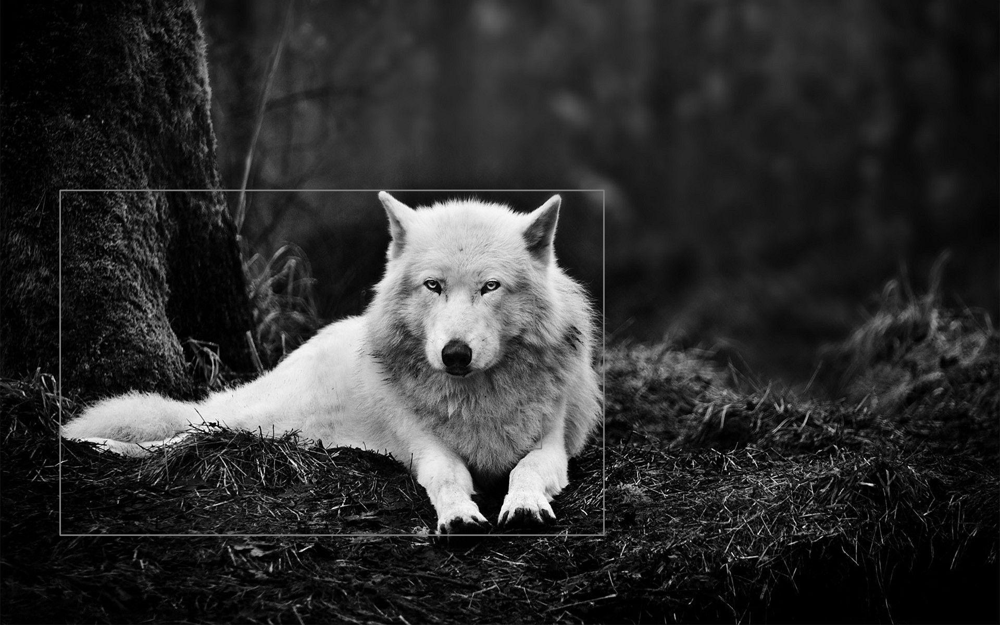
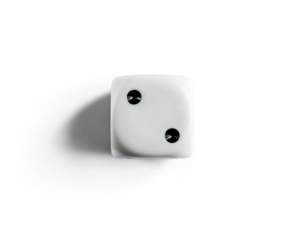
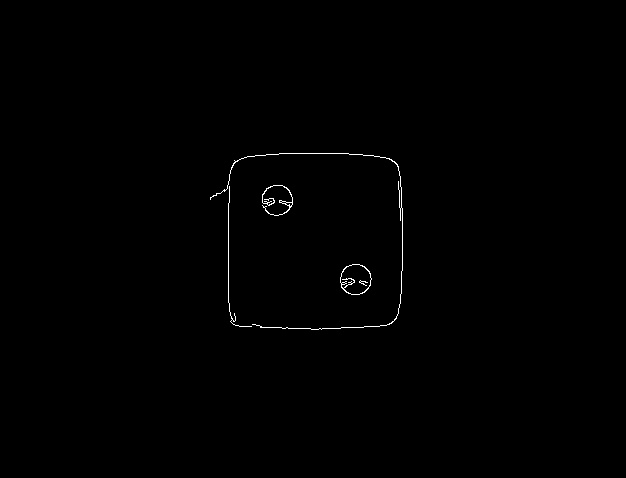
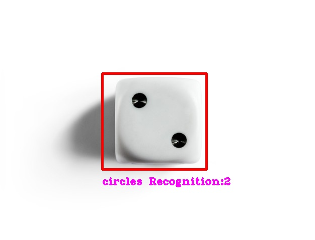

# image_processing_Assignment_27

<h2 align="center">Assignments</h2>

  - threshold **adaptiveThreshold**
  - fincountours **hierarchy**
  - Canny Filter **(Edge Detection)**
  - boundingRect
  - dilate
  - circle **HoughCircles**

<h2> </h2>
<h3 align="center"> befor processing </h3>

 

<h3 align="center"> after processing </h3>

- [x] **In this project, we tried to identify an object with using OpenCV functions**                

 

<h2> </h2>
<h3 align="center"> befor processing </h3>

 

<h3 align="center"> after processing </h3>

- [x] **In this project, we tried to identify a shape without using OpenCV functions**                

 

<h2> </h2>
<h3 align="center"> befor processing </h3>

 

<h3 align="center"> after processing </h3>

- [x] **Canny Edge Detection algorithm**                

 

- [x] **In this project, we tried to detect the number shown on the dice by OpenCV functions**                

 
